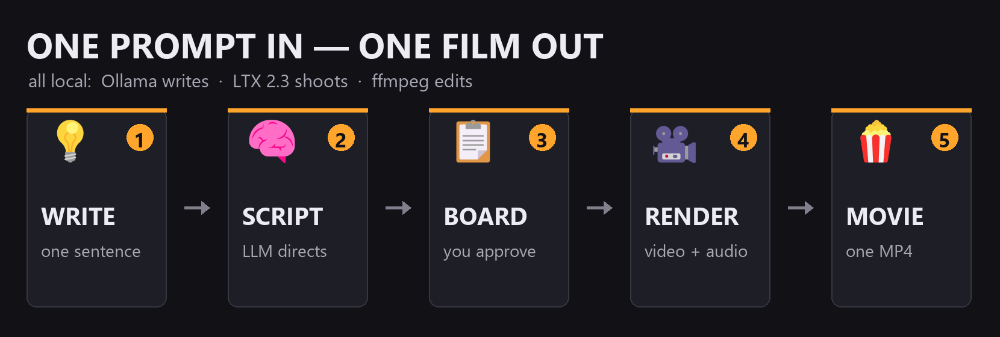
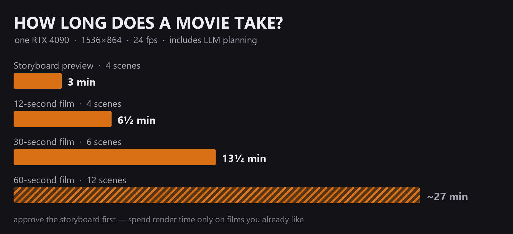

<div align="center">

# 🎬 GmanNodes — Auto Movie Director

### A ComfyUI **custom node pack**: type a movie idea, get a finished short film — with sound.

**GmanNodes** is the pack · **Auto Movie Director** is its flagship suite: seven nodes
(planner · renderer · stitcher · storyboard + helpers) you can wire any way you like.
The included workflow is just the recommended wiring — **the nodes are the product.**

[](LICENSE)
[](https://github.com/comfyanonymous/ComfyUI)
[](https://github.com/Lightricks/ComfyUI-LTXVideo)
[](https://ollama.com)


*this clip — script, camera work, sound, editing, and the same potter in the same studio across every cut — came from one typed sentence*

</div>



<div align="center">

  

*three scenes from one auto-generated film — same woman, same studio, story state carried across the cuts*

</div>

---

## Want approval power? Storyboard first (optional)

The fastest path is one click — but if you'd rather see the movie before spending render time, queue once in **`1) Storyboard`**: one picture per scene in minutes, laid out like an edit bay with timecodes, the script under each shot, and a **location chip** on every tile so you can see which scenes share a place. Like it? Flip the switch to **`2) Storyboard To Movie`**, queue again — **every scene starts on the exact picture you approved** (that's the point of a storyboard), comes back with motion and a generated soundtrack, and the film lands as one MP4 that plays right on the node.


Per-scene prompt boxes live on the Planner node — type into any scene to override it, leave it blank and the AI writes it. Change the scene count and the boxes (with their thumbnails) follow.

## Quick start

```bash
cd ComfyUI/custom_nodes
git clone https://github.com/AdamGman/ComfyUI-GmanNodes
```

Restart ComfyUI → open **`example_workflows/Auto Movie Director.json`** → type your idea → set the mode switch to `3) Auto Movie` → Queue. 🍿 That's the whole thing — script, scenes, sound and editing happen on their own.

Want to check it before the long render? Mode `1) Storyboard` shows you one picture per scene in minutes; approve it, flip to `2) Storyboard To Movie` and every scene starts on the exact picture you saw.

## How long does it take?



## Everything is a dial

| Story | Picture |
|---|---|
| **Scenes**: 1–24, each with its own optional prompt box | **Resolution**: anything /32 up to 2048² (1536×864 = 24 GB sweet spot) |
| **Length**: any seconds per scene (frames auto-snap to LTX's grid) | **Frame rate**: 8–60 fps (24 = cinema) |
| **LLM**: any [Ollama model](https://ollama.com/library) by name — **auto-downloaded** if missing | **Sampler / scheduler / steps / cfg / seed**: fully exposed |
| **Style**: one field appended to every scene | **Continuity dials**: how hard scenes stick to their room, their approved picture, or an unbroken take |
| **Per-scene overrides**: your line beats the AI's | **Storyboard size**: leave at 0 (= movie width) and the movie **reuses the board's groundwork free** |

**The four modes on the switch:**

1. **`1) Storyboard`** — one picture per scene, in minutes. Check the movie before you spend render time on it.
2. **`2) Storyboard To Movie (Exact Frames)`** — the movie, from your approved board: every scene starts on the exact picture you approved. That's the point of a storyboard.
3. **`3) Auto Movie (Skip The Storyboard)`** — the one-click movie. The AI designs a handful of recurring places, each gets a rendered anchor picture, and the camera returns to *the same room* every time. Every scene is a fresh camera setup — same hero, new shot, like real film cuts — and each room *remembers what happened in it* (tape the window in scene 9 and it's still taped in scene 14).
4. **`4) Anthology (Scenes Independent)`** — every scene invents its own look. Loosest and most random — fun for showcase reels, not for telling one story.

> Long films: launch ComfyUI with `--cache-lru 60` (the included start script does) to keep RAM bounded across many scenes.

## The nodes you get

All under the **GmanNodes → 🎬 Auto Movie Director** category in the node menu (search "gman"):

| Node | Job |
|---|---|
| 🎬 **Ollama Movie Planner (GmanNodes)** | idea → plot, character sheet, **recurring locations + flow/cut continuity tags**, per-scene prompts with shot grammar + sound design. Grows per-scene override boxes with live thumbnails right on the node. |
| 🎬 **LTX Movie Renderer (GmanNodes)** | one node that expands into a full LTX render chain per scene at runtime — all four modes on one switch, every quality dial exposed. |
| 🎬 **Movie Stitcher (GmanNodes)** | ffmpeg-concats the scenes into one MP4 (H.264 + AAC), previews it on the node. |
| 🎬 Storyboard · Scene Writer · Load Frame · Path Join | the renderer's building blocks — usable standalone in your own graphs. |

## What the AI director actually does

The Planner turns your sentence into a **three-act screenplay**: a character sheet with countable anatomy repeated verbatim into every scene (that's what keeps the same hero across cuts), an explicit shot type and camera move per scene (wide → tracking → push-in — never the same twice in a row), a cast of **2–5 recurring locations** with a continuity tag on every scene (default `cut` = the next written scene, a new camera setup in the persistent world; `flow` = the rare unbroken take that rolls straight on), scene-to-scene state (time of day progresses, damage persists), and a concrete **`Audio:` line per scene** that LTX renders into an actual soundtrack. Describe a **world** instead of a hero (or say "no main character") and the planner writes an epic instead: the sheet pins the world's signature forms, scenes are landscapes and colossal structures, and people appear only as rare distant specks for scale. No Ollama running? A built-in act-structure fallback still delivers.

<details>
<summary><b>Requirements</b></summary>

| What | Why |
|---|---|
| [ComfyUI](https://github.com/comfyanonymous/ComfyUI) 0.27+ | node-expansion API |
| [ComfyUI-LTXVideo](https://github.com/Lightricks/ComfyUI-LTXVideo) | LTX video+audio nodes |
| [ComfyUI-GGUF](https://github.com/city96/ComfyUI-GGUF) | only for GGUF-quantized LTX transformers |
| [Ollama](https://ollama.com) | the screenwriter LLM (optional — fallback built in) |
| `imageio-ffmpeg` | stitching (`pip install imageio-ffmpeg` if you don't have VideoHelperSuite) |

**LTX 2.3 models** in your model folders: transformer (fp8 **or** GGUF + distilled LoRA), Gemma text encoder + LTX text projection, video VAE + audio VAE, and the LTX spatial upscaler (recommended — sharpens storyboard frames before they guide the render).

**Optional but worth it:** [LTX 2.3 Crisp Enhance](https://civitai.com/models/2535622/ltx-23-enhancers) — the example workflow ships with it pre-wired at 0.5 (A/B tested: visibly more micro-detail, water beading, crisper materials). Don't have it? Delete that one node.

</details>

<details>
<summary><b>Where files land</b></summary>

Everything for one movie lives in one project folder:

```
output/auto_movie/<your_movie_title>_<id>/
├── <name>_<run>.mp4       ← 🍿 the finished film (video + audio)
├── plot.txt               ← the script
├── storyboard/            ← storyboard.png · scene_XX.png · scenes.txt
└── takes/<run>/           ← the individual scene MP4s of each render
```

</details>

<details>
<summary><b>Tips that matter</b></summary>

- **Character consistency**: describe your hero *physically* in the idea — body plan, hair, clothes, eye color, size ("a woman in her late 50s with silver hair in a low bun, a terracotta apron…"). The planner repeats those exact facts in every scene prompt.
- **Keep seed + prompts unchanged** between storyboard and movie — that's how your approved pictures are matched to their scenes.
- **Picking a mode**: in a hurry, `3) Auto Movie` — one click, consistency handled. Want control, `1) Storyboard` then `2) Storyboard To Movie` — the movie matches the pictures you approved. `4) Anthology` is the freest and most photographic — great for showcase reels. The script is cached, so re-queuing to compare is cheap.
- **A scene stuck in the previous scene's look** (say, a dawn finale that stays night-dark)? That's the unbroken-take anchor binding hard — lower the flow strength dial, or type that scene's override so the time jump is explicit.
- Long films: launch with `--cache-lru 60` (the included start script does) so RAM stays bounded — without it, 12+ scenes at high res wants 32 GB+ free.

</details>

---

<div align="center">

[Security policy](SECURITY.md) · **by [AdamGman](https://github.com/AdamGman)** · MIT

</div>
